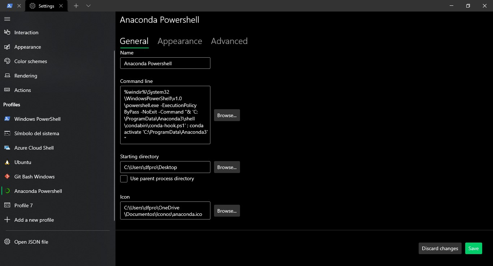

---

---

# Puesta en marcha de todo

Cuando se es desarrollador con python, es normal trabajar en varios proyectos a la vez. Cada uno de estos proyectos puedes funcionar mediante distintas versiones de python y puede requerir distintas dependendencias (librerías), las que a su vez también pueden ser de distintas versiones. 

Existen dos métodos para solucionar dicho. Uno es utilizar **virtualenv** y el otro **Anaconda**. En esta oportunidad se explicará a fondo Anaconda.

## Anaconda

> **Con Anaconda puedes crear un entorno virtual para cada proyecto. Cada entorno puede funcionar sobre distintas versiones de python, distintas dependencias (aplicaciones, paquetes o librerías) y distintas versiones de dichas dependencias.**

Anaconda es una Suite de código abierto que abarca una serie de aplicaciones, librerías y conceptos diseñados para el desarrollo de la **Ciencia de datos con Python**. En líneas generales **Anaconda Distribution es una distribucción de Python** que funciona como un **gestor de entorno**, un **gestor de paquetes** y que posee una **colección de [más de 720 paquetes de código abierto](https://docs.anaconda.com/anaconda/packages/pkg-docs.html).**

Anaconda Distribution se agrupa en 4 sectores o soluciones tecnológicas, **Anaconda Navigator**, **Anaconda Project**, Las **librerías de Ciencia de datos** y **Conda**. Todas estás se instalan de manera automática y en un procedimiento muy sencillo.


Cuando instalamos Anaconda tendremos disponibles todas estas herramientas ya configuradas, podemos gestionarla mediante la interfaz gráfica de usuario Navigator o podemos utilizar Conda para la administración mediante la consola. Puede instalar, eliminar o actualizar cualquier paquete Anaconda con unos pocos clics en Navigator o con un solo comando de Conda.

Esta Suite de herramienta esta diseñada para la Ciencia de datos con Python pero **es útil para la mayoría de los desarrolladores con Python**, cuenta con una gran cantidad de aplicaciones y paquetes que nos permitirán ser más eficientes.

## Puesta en marcha de un proyecto

Una vez instalado, tendás que crear y activar un ambiente de `conda`.

```shell
# navigate to the mflix-python directory
cd mflix-python

# if linux: enable the "conda" command in Terminal
echo ". /anaconda3/etc/profile.d/conda.sh" >> ~/.bash_profile
source ~/.bash_profile

# create a new environment for MFlix
conda create --name mflix

# activate the environment
conda activate mflix
```

Puedes desactivar el ambiente con el siguiente comando:

```shell
conda deactivate
```

### Advertencia

Puede ocurrir que la powershell no sea capaz de ejecutar los comandos activate y deactivate. Para solucionar este problema existen varios caminos. Detallaré los que he descubierto:

#### Anaconda Powershell Prompt

Al instalar anaconda, se crea en la lista de programas de windows un acceso directo que permite iniciar la **Anaconda Powershell Prompt** ya iniciado. Puedes acceder mediante la barra de búsqueda.


#### Windows Terminal

Para aquellos que usan la aplicación Windows Terminal, pueden agregar un nuevo perfil que ejecute directamente esta aplicación. El proceso es sencillo:

1. Debes abrir la configuración de Windows Terminal y acceder a la creación de un perfil nuevo.
2. Luego, debes abrir la ubicación de la **Anaconda Powershell Prompt**. Puedes encontrarla mediante la búsqueda de windows. 
	
	

3. Posteriormente, debes acceder a las propiedades del acceso directo de **Anaconda Powershell Prompt** y compiar el texto que aparece en el Destino.

   

4. Finalmente, debes pegar el Destino en el campo **Command Line** de la creación de perfiles en Windows Terminal y terminar de llenar el resto de los campos y salvar los cambios.

   

